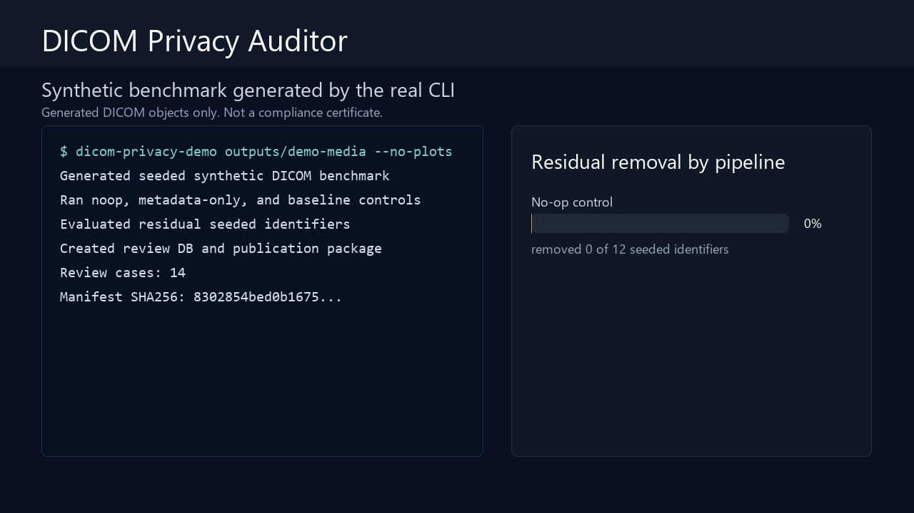
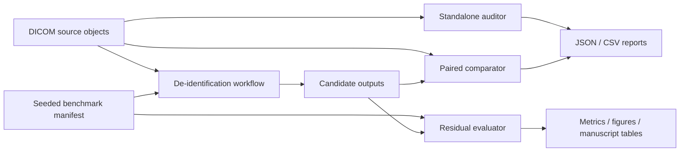

# DICOM Privacy Auditor

[](https://github.com/AKaturu/dicom-privacy-auditor/actions/workflows/tests.yml)
[](https://github.com/AKaturu/dicom-privacy-auditor/actions/workflows/security.yml)
[](https://www.python.org/)
[](LICENSE)

A reproducible DICOM privacy-risk auditor and synthetic benchmark for evaluating de-identification workflows across metadata, nested sequences, private attributes, filenames, UIDs, dates, DICOMDIR-like references, File Meta Information, preambles, overlays, and burned-in pixel annotations.



> **Research prototype—not a compliance certificate.** This repository does not prove compliance with DICOM PS3.15, HIPAA, GDPR, or institutional policy. A file with zero findings is not proven safe for release. The built-in de-identifier is a transparent benchmark baseline, not a production de-identification engine.

**Validation status:** Software functionality has been tested using synthetic or public data as described below. This project has not undergone prospective clinical validation and is not intended for independent clinical decision-making.

| Evidence | Status |
|---|---|
| Unit tests | Passed (163 passed, 7 skipped, 85.77% coverage) |
| Synthetic end-to-end test | Complete |
| Public-data evaluation | Partial (7 of 10 external preflight checks ready) |
| Expert review | Not completed |
| Institutional validation | Not completed |
| Prospective clinical validation | Not completed |

## Clinical Problem

Deleting `PatientName` is not enough. Identifying information can remain in nested sequence items, private attributes, free text, filenames, UIDs, dates, File Meta Information, the 128-byte preamble, overlays, structured content, or image pixels. DICOM PS3.15 explicitly notes that use of the Attribute Confidentiality Profiles does not guarantee complete de-identification.

## Capabilities

- Standalone DICOM privacy auditor (recursive metadata, pixel scan, sequence traversal)
- Source-vs-candidate paired comparator (retained values, unchanged UIDs/dates, risky pixels)
- Complete PS3.15 policy engine (user-local rule cache via `dicom-privacy-ps315`)
- MIDI-B SQLite importer and 10-action evaluator
- Deterministic 10-stratum synthetic benchmark with confidence intervals and McNemar tests
- External-tool adapters (Orthanc REST, RSNA DICOM Anonymizer, RSNA CTP, generic pipelines)
- Blinded human pixel/metadata review workstation with bounding boxes and Cohen's kappa
- IOD-aware context layer (user-local PS3.3-derived registry)
- Corpus-level UID, reference, pseudonym, and File Meta consistency checks
- Atomic study processing with resumable checkpoints and quarantine
- QIDO-RS, WADO-RS, and STOW-RS DICOMweb client
- MIDI-B live-tool campaign runner with reproducibility hashes
- Native Tk desktop, Streamlit web interface, and self-contained executables
- Privacy-safe reports with redacted values and one-way hashes by default

## Demonstrated Results

The synthetic benchmark generates a labeled corpus across 10 privacy-risk strata (standard metadata, nested sequences, private tags, free text, filenames, dates, UIDs, burned-in pixels, File Meta, preamble). Three built-in controls validate the evaluation pipeline:
- **noop**: retains all artificial identifiers (negative control)
- **metadata-only**: cleans metadata but leaves filename and pixel risks
- **baseline**: benchmark-aware removal of injected identifiers (positive technical control)

Outputs include machine-readable JSON, CSV, Wilson 95% confidence intervals, exact McNemar paired tests, and publication-ready figures.

## Quick Start

```bash
python -m venv .venv && source .venv/bin/activate
python -m pip install -e ".[dev,all]"

# One-command synthetic demonstration:
dicom-privacy-demo demo-release --overwrite

# Audit DICOM objects:
dicom-privacy-audit sample_data --pixel-scan --json reports/audit.json
```

## Limitations

- IOD-aware evaluation does not replace a complete DICOM validator
- Semantic cleaning (`C` actions) and burned-in text cannot be certified automatically
- The experimental pixel scan is not OCR
- MIDI-B text checks are literal; `pixels retained` requires exact decoded-array equality
- No real clinical data are included; use synthetic data for public demos
- The project does not redistribute the DICOM Standard; users generate a local rule cache

## Documentation

| Topic | File |
|---|---|
| Data policy (synthetic-first) | [REAL_DATA_SETUP.md](docs/REAL_DATA_SETUP.md) |
| Benchmark design and ground truth | [BENCHMARK.md](docs/BENCHMARK.md) |
| PS3.15 rule engine | [PS315_ENGINE.md](docs/PS315_ENGINE.md) |
| MIDI-B import and scoring | [MIDI_B.md](docs/MIDI_B.md) |
| Orthanc and RSNA adapters | [ADAPTERS.md](docs/ADAPTERS.md) |
| Human review workstation | [HUMAN_REVIEW.md](docs/HUMAN_REVIEW.md) |
| IOD context layer | [IOD_AWARE.md](docs/IOD_AWARE.md) |
| Corpus integrity | [CORPUS_INTEGRITY.md](docs/CORPUS_INTEGRITY.md) |
| Study workflows | [STUDY_WORKFLOWS.md](docs/STUDY_WORKFLOWS.md) |
| DICOMweb client | [DICOMWEB.md](docs/DICOMWEB.md) |
| MIDI-B live campaign | [MIDI_LIVE_CAMPAIGN.md](docs/MIDI_LIVE_CAMPAIGN.md) |
| Native builds and signing | [EXECUTABLES.md](docs/EXECUTABLES.md) |
| Dependency locking | [DEPENDENCY_LOCKING.md](docs/DEPENDENCY_LOCKING.md) |
| Release process and local gate | [RELEASE_PROCESS.md](docs/RELEASE_PROCESS.md), [LOCAL_RELEASE_GATE.md](docs/LOCAL_RELEASE_GATE.md) |
| External pipelines | [EXTERNAL_PIPELINES.md](docs/EXTERNAL_PIPELINES.md) |
| Data dictionary | [DATA_DICTIONARY.md](docs/DATA_DICTIONARY.md) |
| Threat model | [THREAT_MODEL.md](docs/THREAT_MODEL.md) |
| Manuscript plan | [MANUSCRIPT_PLAN.md](docs/MANUSCRIPT_PLAN.md) |
| Validation and limitations | [VALIDATION.md](docs/VALIDATION.md) |
| Publication reports | [PUBLICATION_REPORTS.md](docs/PUBLICATION_REPORTS.md) |
| Security hardening | [SECURITY_HARDENING.md](docs/SECURITY_HARDENING.md) |
| Schema migrations | [SCHEMA_MIGRATIONS.md](docs/SCHEMA_MIGRATIONS.md) |
| Demo media generation | [DEMO_MEDIA.md](docs/DEMO_MEDIA.md) |
| Legal notices (DICOM trademark) | [LEGAL_NOTICES.md](docs/LEGAL_NOTICES.md) |
| Study protocol | [STUDY_PROTOCOL.md](STUDY_PROTOCOL.md) |
| Contribution guide | [CONTRIBUTING.md](CONTRIBUTING.md) |
| Security reporting | [SECURITY.md](SECURITY.md) |

## Architecture



## Reproducible Release Hardening

All GitHub Actions are pinned to full commit SHAs. A hashed runtime lock is provided for CPython 3.13/Linux x86-64:

```bash
pip install --require-hashes --only-binary=:all: \
  -r requirements/locks/cp313-linux-x86_64-runtime.txt
pip install --no-deps .
```

## Citation

See [CITATION.cff](CITATION.cff). Until a peer-reviewed version exists, cite the software release and commit hash.

## Legal Notices

DICOM® is the registered trademark of the National Electrical Manufacturers Association.

## License

MIT. See [LICENSE](LICENSE).
