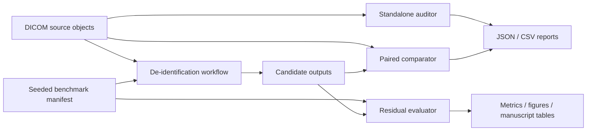

# DICOM Privacy Auditor

[](https://github.com/AKaturu/dicom-privacy-auditor/actions/workflows/tests.yml)
[](https://github.com/AKaturu/dicom-privacy-auditor/actions/workflows/security.yml)
[](https://www.python.org/)
[](LICENSE)

A reproducible DICOM privacy-risk auditor and synthetic benchmark for evaluating de-identification workflows across metadata, nested sequences, private attributes, filenames, UIDs, dates, File Meta Information, preambles, and burned-in pixel annotations.

> **Research prototype—not a compliance certificate.** This repository does not prove compliance with DICOM PS3.15, HIPAA, GDPR, or institutional policy. A file with zero findings is not proven safe for release. The built-in de-identifier is a transparent benchmark baseline, not a production de-identification engine.

## Data Policy For GitHub

This public project is synthetic-first. Demos, screenshots, videos, examples, and automated tests should use the synthetic DICOM data generated by the repository.

Real MIDI-B data and institutional DICOM exports are supported for governed local validation, but they are not part of the GitHub demo path and must not be committed. Keep real corpora, answer-key databases, reviewer identity mappings, endpoint credentials, and signing secrets outside the repository. See [`docs/REAL_DATA_SETUP.md`](docs/REAL_DATA_SETUP.md) for the opt-in real-data workflow.

## Repository guide

| Path | Purpose |
|---|---|
| `src/dicom_privacy_auditor/cli.py` | Standalone DICOM privacy audit CLI |
| `src/dicom_privacy_auditor/benchmark/` | Synthetic benchmark generation, evaluation, and reporting |
| `src/dicom_privacy_auditor/ps315/` | User-local DICOM PS3.15 rule-cache workflow |
| `src/dicom_privacy_auditor/review/` | Human-review database, models, and rendering helpers |
| `src/dicom_privacy_auditor/adapters/` | Orthanc, RSNA, and generic de-identification pipeline adapters |
| `src/dicom_privacy_auditor/dicomweb/` | QIDO-RS, WADO-RS, and STOW-RS client workflows |
| `schemas/` | JSON schemas for reports, manifests, reviews, campaigns, and release gates |
| `docs/` | Methods, security, release, real-data setup, and publication documentation |
| `scripts/` | Release, validation, packaging, and documentation guard scripts |
| `tests/` | Unit, integration, packaging, schema, and adversarial tests |

## Why this project exists

Deleting `PatientName` is not enough. Identifying information can remain in nested sequence items, private attributes, free text, filenames, UIDs, dates, File Meta Information, the 128-byte preamble, overlays, structured content, or image pixels. DICOM PS3.15 explicitly notes that use of the Attribute Confidentiality Profiles does not guarantee complete de-identification of the information object.

This project provides twelve complementary components:

1. **Standalone auditor** — flags probable privacy risks in one or more DICOM objects.
2. **Paired comparator** — compares a source object with a candidate output and detects retained values, unchanged dates, unchanged instance-level UIDs, and unchanged risky pixels.
3. **Full PS3.15 policy engine** — applies complete user-generated Table E.1-1 and E.1-2 rule caches to source/output pairs without redistributing the DICOM Standard.
4. **Synthetic benchmark** — creates a seeded, labeled corpus and evaluates complete de-identification workflows with machine-readable results, confidence intervals, paired tests, figures, and reproducibility metadata.
5. **MIDI-B importer/evaluator** — normalizes the public SQLite answer key and scores all ten published action types.
6. **External-tool adapters** — runs Orthanc, RSNA DICOM Anonymizer, RSNA CTP, or a generic directory pipeline against the same benchmark.
7. **Human review workstation** — supports blinded pixel/metadata adjudication, region labels, audit exports, and interrater agreement.
8. **IOD-aware context layer** — combines user-local PS3.3-derived module/type data with PS3.15 pair evaluation.
9. **Corpus consistency evaluator** — checks UID mappings, references, pseudonyms, dates, and File Meta consistency across a collection.
10. **Atomic study runner** — stages, resumes, quarantines, and publishes de-identified studies as all-or-nothing units.
11. **DICOMweb client** — supports QIDO-RS discovery, WADO-RS retrieval, and STOW-RS storage with secure defaults.
12. **Live MIDI-B campaign runner** — executes frozen tool configurations and records reproducibility hashes and validation outputs.

## Current feature set

- Complete PS3.15 Table E.1-1 and E.1-2 evaluation after users generate a local rule cache from an official document
- No bundled Part 15 DOCX or complete extracted standards tables
- All profile-option columns represented without invented precedence
- MIDI-B SQLite import and all ten published action evaluators
- Orthanc REST, RSNA DICOM Anonymizer, and RSNA CTP adapters
- Blinded human pixel/metadata review with bounding boxes, latest-decision agreement, schema-validated disagreement/adjudication packets, SQLite integrity checks, and integrity-hashed exports
- User-local IOD registry and IOD-aware Type 1/1C/2/2C attribute evaluation
- Corpus-level UID, reference, pseudonym, date-shift, and File Meta consistency checks
- Atomic study processing with resumable checkpoints and quarantine-by-default failure handling
- QIDO-RS, WADO-RS, and STOW-RS workflows with HTTPS/TLS and environment-secret safeguards
- Full-corpus MIDI-B live-tool campaign orchestration with code, configuration, and dataset hashes
- Recursive sequence traversal with stable paths
- High-risk standard metadata checks
- Private creator and private-element detection
- Free-text review and identifier-pattern detection
- Date/time review using keywords and VRs
- Optional instance-level UID review
- File Meta Information and nonzero-preamble checks
- Filename privacy checks
- Embedded content, overlays, signatures, and original-attribute review signals
- Experimental high-contrast border-region pixel scan
- Privacy-safe reports with redacted values and one-way hashes by default
- Source-versus-output comparison
- JSON and CSV exports
- Native Tk desktop interface and self-contained executables
- Streamlit interface
- Deterministic ten-stratum synthetic benchmark
- No-op, metadata-only, and benchmark-aware baseline controls
- External command adapters without shell execution
- Basic DICOM readability and consistency validation
- Wilson 95% confidence intervals
- Exact paired McNemar comparisons
- Publication-oriented CSV, Markdown, JSON, and PNG outputs
- Tests, coverage, linting, static typing, security scans, schema/configuration guards, dependency locks, deterministic source/release packaging, Docker, CodeQL, dependency review, SBOMs, and release attestations

## Local release completion gate

Run every validation step that does not require an external corpus, live service, independent reviewer, target-platform runner, or signing credential:

```bash
python scripts/run_local_release_gate.py . \
  --output validation/local-release-gate.json
```

A report is marked `passed` only when action pins, workflow YAML, schemas and examples, dependency locks, `pip check`, Ruff lint and formatting, compilation, mypy, Bandit, the full test/coverage suite, package builds, distribution policy, and byte-for-byte wheel and normalized-sdist reproducibility all succeed. See [`docs/LOCAL_RELEASE_GATE.md`](docs/LOCAL_RELEASE_GATE.md) and [`docs/RELEASE_PROCESS.md`](docs/RELEASE_PROCESS.md).

## Architecture



## Installation

```bash
python -m venv .venv
source .venv/bin/activate
# Windows PowerShell: .venv\Scripts\Activate.ps1

python -m pip install --upgrade pip
pip install -e ".[dev,all]"
```

## Native executables

The release includes a double-click desktop auditor and a unified command-line executable. Native builds do not require Python. Release archives are generated for Windows x64, Linux x64, macOS Apple Silicon, and macOS Intel.

The desktop application saves privacy-safe JSON and CSV reports and never exposes raw DICOM values or source paths. The terminal executable provides all commands through one entry point:

```bash
DICOMPrivacyAuditor-CLI audit sample_data --json audit.json --csv audit.csv
DICOMPrivacyAuditor-CLI compare source.dcm candidate.dcm
DICOMPrivacyAuditor-CLI benchmark all workspace --pipeline baseline --overwrite
DICOMPrivacyAuditor-CLI ps315 info --json
# First-time setup for the policy engine:
DICOMPrivacyAuditor-CLI ps315 --edition 2026c prepare-data --download
DICOMPrivacyAuditor-CLI midi inspect answer_key.sqlite
```

Build locally on the target operating system:

```bash
pip install -e ".[packaging,analysis,standards]"
python scripts/build_executables.py
python scripts/package_native_release.py
```

PyInstaller is not a cross-compiler, so the included GitHub Actions workflow performs each build on a native runner. See [`docs/EXECUTABLES.md`](docs/EXECUTABLES.md) for release, code-signing, notarization, and SmartScreen/Gatekeeper notes.

## Audit DICOM objects

```bash
dicom-privacy-audit sample_data \
  --pixel-scan \
  --json reports/audit.json \
  --csv reports/audit.csv
```

Useful options:

```bash
# Add low-severity review flags for instance-level UIDs
dicom-privacy-audit export_folder --review-uids

# Fail CI when a high- or critical-severity finding occurs
dicom-privacy-audit export_folder --fail-on high

# Explicitly include raw values; unsafe for real identifiers
dicom-privacy-audit export_folder --show-values
```

By default, evidence is rendered like this:

```text
<redacted sha256:4a25f2c7ad9b length:18>
```

This permits repeated-value correlation without copying the original value into logs or reports.

## Compare a source and candidate object

```bash
dicom-privacy-compare source.dcm candidate.dcm \
  --json reports/comparison.json \
  --csv reports/comparison.csv
```

Paired comparison is the correct way to determine whether a source UID or date was actually changed. A standalone auditor cannot reliably infer that from the candidate alone.

## Evaluate DICOM PS3.15 profiles

The project intentionally does not redistribute the DICOM Standard, the official Part 15 DOCX, or complete extracted tables. Generate a user-local rule cache from an official document before using the policy engine.

Temporarily download the current official DOCX, parse it locally, and delete the temporary source file afterward:

```bash
dicom-privacy-ps315 --edition 2026c prepare-data --download
```

Or parse an official document you obtained separately:

```bash
dicom-privacy-ps315 --edition 2026c prepare-data \
  --source /path/to/part15.docx
```

Inspect local installation status and provenance:

```bash
dicom-privacy-ps315 info --json
```

Query rules and evaluate a source/output pair:

```bash
dicom-privacy-ps315 rules --tag 00100010

dicom-privacy-ps315 evaluate source.dcm candidate.dcm \
  --option clean_descriptors \
  --option retain_longitudinal_modified_dates \
  --json reports/ps315.json \
  --csv reports/ps315.csv
```

Generated tables are stored outside the package in a user-controlled data directory and are excluded from source archives, wheels, source distributions, containers, and native executables. Semantic `C` actions, pixel cleaning, and recognizable-feature removal remain review tasks. See [`docs/PS315_ENGINE.md`](docs/PS315_ENGINE.md).

## Import and evaluate MIDI-B

Use this only after downloading MIDI-B resources into an approved local directory outside the repository. For public demos, use the synthetic commands in [Reproduce the demonstration](#reproduce-the-demonstration) or [One-command synthetic demonstration](#one-command-synthetic-demonstration).

```bash
dicom-privacy-midi inspect /data/midi/answer_key.sqlite

dicom-privacy-midi import \
  /data/midi/answer_key.sqlite \
  /data/midi/source-dicom \
  workspaces/midi-import \
  --patient-mapping /data/midi/patient_mapping.csv \
  --uid-mapping /data/midi/uid_mapping.csv \
  --overwrite

dicom-privacy-midi evaluate \
  workspaces/midi-import \
  /data/midi/candidate-output \
  workspaces/midi-evaluation
```

The evaluator supports `date shifted`, `patid consistent`, `pixels hidden`, `pixels retained`, `tag retained`, `text notnull`, `text removed`, `text retained`, `uid changed`, and `uid consistent`. See [`docs/MIDI_B.md`](docs/MIDI_B.md).

## Run Orthanc and RSNA adapters

```bash
dicom-privacy-adapter probe orthanc configs/orthanc.example.json

dicom-privacy-adapter run-benchmark \
  orthanc configs/orthanc.example.json \
  benchmark_dir run-orthanc --overwrite
```

Adapters are included for Orthanc single-instance REST anonymization, the RSNA DICOM Anonymizer DICOM SCP, RSNA CTP watched-directory pipelines, and generic directory pipelines. See [`docs/ADAPTERS.md`](docs/ADAPTERS.md).


## Human-in-the-loop review

```bash
dicom-privacy-review create source candidate workspaces/review.sqlite --overwrite
dicom-privacy-review serve workspaces/review.sqlite
dicom-privacy-review agreement workspaces/review.sqlite reviewer-a reviewer-b
dicom-privacy-review export workspaces/review.sqlite reports/review.json
```

Review is blinded by default. The workstation supports side-by-side source/candidate pixels, frame and window controls, recursive metadata diffs, pixel bounding boxes, timestamped decisions, secondary-review escalation, and Cohen's kappa. See [`docs/HUMAN_REVIEW.md`](docs/HUMAN_REVIEW.md).

## Add IOD context to PS3.15 evaluation

The project does not redistribute PS3.3 tables. Prepare a user-local registry from separately generated IOD/module JSON, then enable contextual evaluation:

```bash
dicom-privacy-iod --edition local-2026c prepare-data   --source /path/to/generated-iod-json

dicom-privacy-ps315 evaluate source.dcm candidate.dcm   --iod-aware   --iod-registry /path/to/iod_registry_local-2026c.json   --json reports/ps315-iod.json
```

The context layer flags attributes absent from the active IOD, enforces basic Type 1/2 retention/non-empty constraints, and marks unresolved conditional requirements for review. It is not a substitute for a complete DICOM validator. See [`docs/IOD_AWARE.md`](docs/IOD_AWARE.md).

## Evaluate corpus consistency

```bash
dicom-privacy-corpus evaluate source candidate   --json reports/corpus.json   --csv reports/corpus.csv
```

This detects cross-file UID collisions and one-to-many mappings, broken reference mappings, inconsistent patient pseudonyms and date shifts, retained identifiers, and File Meta inconsistencies. See [`docs/CORPUS_INTEGRITY.md`](docs/CORPUS_INTEGRITY.md).

## Process complete studies

```bash
dicom-privacy-study process-local source output   --pipeline orthanc   --adapter-config configs/orthanc.example.json   --quarantine quarantine
```

Studies are processed in a staging directory and are published only when every instance succeeds. Partial and failed studies are quarantined by default. See [`docs/STUDY_WORKFLOWS.md`](docs/STUDY_WORKFLOWS.md).

## Use DICOMweb

```bash
export DICOMWEB_BEARER_TOKEN='...'
dicom-privacy-dicomweb --config configs/dicomweb.example.json search-studies   --query StudyDate=20250101-20251231

dicom-privacy-study process-dicomweb STUDY_UID workspaces/web-run   --source-config source-dicomweb.json   --destination-config destination-dicomweb.json   --pipeline baseline
```

The client supports QIDO-RS, WADO-RS, and STOW-RS with HTTPS required by default, TLS verification, environment-based secrets, retries, and request/response bounds. See [`docs/DICOMWEB.md`](docs/DICOMWEB.md).

## Run a complete MIDI-B live-tool campaign

This is an opt-in real-data campaign workflow, not the public GitHub demo path. Keep the MIDI-B corpus and answer-key database outside the repository and follow [`docs/REAL_DATA_SETUP.md`](docs/REAL_DATA_SETUP.md).

```bash
dicom-privacy-campaign run   workspaces/midi-import   workspaces/midi-live   configs/midi-live-campaign.example.json   --overwrite
```

Campaign records include the application version, tool configuration SHA-256, imported MIDI manifest SHA-256, environment, adapter probe, runtime, failures, internal evaluation, and optional official-validator execution. See [`docs/MIDI_LIVE_CAMPAIGN.md`](docs/MIDI_LIVE_CAMPAIGN.md).

## Run the web interface

```bash
streamlit run app.py
```

The interface supports multi-file auditing and source-versus-output comparison. Do not upload real protected data to publicly hosted instances.

## Run the complete synthetic benchmark

```bash
dicom-privacy-benchmark all workspaces/baseline \
  --pipeline baseline \
  --cases-per-stratum 5 \
  --clean-controls 10 \
  --seed 20260619 \
  --overwrite
```

This creates:

```text
workspaces/baseline/
├── benchmark/
│   ├── manifest.json
│   └── objects/*.dcm
├── run-baseline/
│   ├── run_manifest.json
│   └── objects/*.dcm
└── evaluation-baseline/
    ├── evaluation.json
    ├── injection_results.csv
    ├── stratum_metrics.csv
    ├── REPORT.md
    └── figures/*.png
```

### Built-in controls

| Pipeline | Purpose | Expected behavior |
|---|---|---|
| `noop` | Negative control | Retains every artificial identifier |
| `metadata-only` | Partial comparator | Cleans metadata but intentionally leaves filename and pixel risks |
| `baseline` | Positive technical control | Uses the manifest to clean synthetic pixel boxes and safe output names |

The `baseline` pipeline is intentionally benchmark-aware. Its purpose is to verify that the benchmark and evaluator can register successful removal, not to represent a deployable clinical system.

## Benchmark strata

1. Standard metadata
2. Nested sequence attributes
3. Private attributes
4. Free-text attributes
5. File names
6. Dates and times
7. Instance-level UIDs
8. Burned-in pixel annotations
9. File Meta Information
10. The 128-byte DICOM preamble

Clean controls contain no injected artificial identifier.

## Evaluate an external tool

The external adapter runs one file at a time without invoking a shell:

```bash
dicom-privacy-benchmark run benchmark_dir run_external \
  --external-name my-tool \
  --external-command python my_wrapper.py --input "{input}" --output "{output}" \
  --output-name-mode preserve

dicom-privacy-benchmark evaluate benchmark_dir run_external evaluation_external
```

Supported placeholders are:

- `{input}`
- `{output}`
- `{output_dir}`
- `{case_id}`
- `{input_name}`

Filename policy is part of workflow-level performance. `preserve` intentionally keeps the original benchmark filename; `safe` assigns a case-ID filename and must be reported as adapter-assisted filename cleaning.

See [`docs/EXTERNAL_PIPELINES.md`](docs/EXTERNAL_PIPELINES.md).

## Compare two workflows

```bash
dicom-privacy-benchmark compare \
  evaluation_a/evaluation.json \
  evaluation_b/evaluation.json \
  --output paired_comparison.json
```

The command reports an exact two-sided McNemar test over shared injected identifiers.

## Reproduce the demonstration

```bash
python scripts/run_demo_benchmark.py --workspace examples/demo_workspace --overwrite
```

The script generates one benchmark and evaluates all three built-in controls against exactly the same injected cases. It uses synthetic DICOM objects only and is the recommended path for GitHub demos.

## Testing and quality checks

Install the full development surface first:

```bash
python -m pip install -e ".[dev,analysis,adapters,standards]"
```

| Check | Command |
|---|---|
| Action, workflow, and schema guards | `python scripts/check_action_pins.py && python scripts/check_workflow_integrity.py . && python scripts/check_schema_integrity.py .` |
| Dependency-lock guard | `python scripts/check_dependency_locks.py .` |
| Lint | `ruff check .` |
| Format | `ruff format --check .` |
| Type check | `mypy` |
| Compile | `python -m compileall -q src scripts tests` |
| Tests and coverage | `PYTEST_DISABLE_PLUGIN_AUTOLOAD=1 pytest -p pytest_cov --cov=dicom_privacy_auditor --cov-report=term-missing --cov-fail-under=82` |
| Local release gate | `python scripts/run_local_release_gate.py . --output validation/local-release-gate.json` |

```bash
ruff check .
pytest --cov=dicom_privacy_auditor --cov-report=term-missing
```

The test suite covers redacted reporting, person-name normalization, nested sequences, private tags, File Meta Information, preambles, paired comparison, UID remapping, pixel review, DICOM consistency, and end-to-end benchmark controls.

## Research outputs

The repository includes:

- [`STUDY_PROTOCOL.md`](STUDY_PROTOCOL.md) — pre-specified validation protocol
- [`docs/BENCHMARK.md`](docs/BENCHMARK.md) — benchmark design and ground truth
- [`docs/DATA_DICTIONARY.md`](docs/DATA_DICTIONARY.md) — output variables
- [`docs/THREAT_MODEL.md`](docs/THREAT_MODEL.md) — privacy and misuse analysis
- [`docs/MANUSCRIPT_PLAN.md`](docs/MANUSCRIPT_PLAN.md) — paper structure and figures
- [`docs/VALIDATION.md`](docs/VALIDATION.md) — interpretation and limitations
- [`docs/EXECUTABLES.md`](docs/EXECUTABLES.md) — native build and release instructions
- [`docs/PS315_ENGINE.md`](docs/PS315_ENGINE.md) — full standards-rule engine
- [`docs/MIDI_B.md`](docs/MIDI_B.md) — public benchmark import and scoring
- [`docs/REAL_DATA_SETUP.md`](docs/REAL_DATA_SETUP.md) — opt-in setup for real MIDI-B or institutional data outside Git
- [`docs/ADAPTERS.md`](docs/ADAPTERS.md) — Orthanc and RSNA integrations
- [`docs/HUMAN_REVIEW.md`](docs/HUMAN_REVIEW.md) — blinded pixel and metadata adjudication
- [`docs/IOD_AWARE.md`](docs/IOD_AWARE.md) — user-local IOD context and limitations
- [`docs/CORPUS_INTEGRITY.md`](docs/CORPUS_INTEGRITY.md) — cross-file UID/date/pseudonym checks
- [`docs/STUDY_WORKFLOWS.md`](docs/STUDY_WORKFLOWS.md) — atomic study staging and quarantine
- [`docs/DICOMWEB.md`](docs/DICOMWEB.md) — QIDO-RS/WADO-RS/STOW-RS workflows
- [`docs/MIDI_LIVE_CAMPAIGN.md`](docs/MIDI_LIVE_CAMPAIGN.md) — full-corpus live-tool orchestration
- [`docs/SECURITY_HARDENING.md`](docs/SECURITY_HARDENING.md) — CI, SBOM, attestation, and runtime controls
- [`docs/LEGAL_NOTICES.md`](docs/LEGAL_NOTICES.md) — DICOM trademark, standards-content, and license boundaries
- [`schemas/benchmark-manifest.schema.json`](schemas/benchmark-manifest.schema.json)
- [`schemas/evaluation.schema.json`](schemas/evaluation.schema.json)
- [`schemas/ps315-evaluation.schema.json`](schemas/ps315-evaluation.schema.json)
- [`schemas/midi-import.schema.json`](schemas/midi-import.schema.json)
- [`schemas/midi-evaluation.schema.json`](schemas/midi-evaluation.schema.json)
- [`schemas/adapter-config.schema.json`](schemas/adapter-config.schema.json)
- [`schemas/iod-registry.schema.json`](schemas/iod-registry.schema.json)
- [`schemas/review-export.schema.json`](schemas/review-export.schema.json)
- [`schemas/review-disagreements.schema.json`](schemas/review-disagreements.schema.json)
- [`schemas/external-validation-config.schema.json`](schemas/external-validation-config.schema.json)
- [`schemas/local-release-gate.schema.json`](schemas/local-release-gate.schema.json)
- [`schemas/release-manifest.schema.json`](schemas/release-manifest.schema.json)
- [`schemas/corpus-report.schema.json`](schemas/corpus-report.schema.json)
- [`schemas/dicomweb-config.schema.json`](schemas/dicomweb-config.schema.json)
- [`schemas/study-run.schema.json`](schemas/study-run.schema.json)
- [`schemas/midi-campaign.schema.json`](schemas/midi-campaign.schema.json)

## Major limitations

- IOD-aware evaluation uses a user-local registry and enforces important placement/type constraints, but it does not execute every PS3.3 conditional statement or replace a complete DICOM validator.
- Semantic cleaning (`C`), burned-in text, graphics, and recognizable visual features cannot be certified automatically by the policy table.
- The experimental pixel scan is not OCR and cannot establish absence of burned-in text.
- MIDI-B text checks are literal and `pixels retained` currently requires exact decoded-array equality.
- The full public MIDI-B collection is not redistributed. Complete live-tool results must not be claimed until the independently downloaded collection and official validator have actually been run; this release supplies the campaign workflow, not fabricated external results.
- Automated tests use mocked/local integration services. Live Orthanc and RSNA installations must be version-frozen and recorded in `validation/live/` before publication claims.
- The built-in synthetic benchmark remains narrower than MIDI-B and does not cover every compressed, multiframe, pathology, RT, SR, or presentation-state edge case.
- Benchmark-aware pixel rectangles give the positive control information a real de-identification tool would not possess automatically.
- No real clinical data are included.
- The project does not redistribute the DICOM Standard or complete extracted standards tables; users must generate their own local cache from an official document.

## Safety and governance

- Use synthetic or properly governed data during development.
- Do not commit real identifiers, private institutional configuration, keys, or reversible pseudonym maps.
- Do not commit real DICOM corpora, MIDI-B answer-key databases, reviewer identity maps, or unredacted live-validation logs.
- Obtain a written institutional determination before analyzing clinical exports.
- Treat generated reports as potentially sensitive because paths, hashes, and workflow logs may still be linkable within an institution.
- Use institutionally approved key management for any production pseudonymization.

## Contributing and security

- Contribution workflow: [`CONTRIBUTING.md`](CONTRIBUTING.md)
- Security and privacy reporting: [`SECURITY.md`](SECURITY.md)
- Legal and DICOM trademark boundaries: [`docs/LEGAL_NOTICES.md`](docs/LEGAL_NOTICES.md)

## Privacy-preserving local artifacts

Reports, review databases, campaign checkpoints, external-resource locks, publication packages, and evidence directories are written with owner-only permissions where supported. Publication manifests and appendices redact absolute input/workspace paths by default; use `--disclose-paths` only inside a governed environment. Treat hashes, UIDs, timestamps, reviewer decisions, and linkage records as potentially sensitive even when raw values are absent.

## Standards and primary references

- DICOM PS3.15, current Attribute Confidentiality Profiles: https://dicom.nema.org/medical/dicom/current/output/chtml/part15/chapter_e.html
- DICOM PS3.18, DICOMweb services: https://dicom.nema.org/medical/dicom/current/output/chtml/part18/
- MIDI-B public collection: https://www.cancerimagingarchive.net/collection/midi-b-test-midi-b-validation/
- Orthanc anonymization REST API: https://orthanc.uclouvain.be/book/users/anonymization.html
- RSNA DICOM Anonymizer: https://github.com/RSNA/anonymizer
- RSNA CTP documentation: https://mircwiki.rsna.org/index.php?title=MIRC_CTP
- pydicom Dataset API: https://pydicom.github.io/pydicom/stable/reference/generated/pydicom.dataset.Dataset.html

## Citation

See [`CITATION.cff`](CITATION.cff). Until a peer-reviewed version exists, cite the software release and commit hash.

## Legal and trademark notice

DICOM® is the registered trademark of the National Electrical Manufacturers Association for its standards publications relating to digital communications of medical information, all rights reserved.

DICOM Privacy Auditor is independent and is not affiliated with, sponsored by, endorsed by, or certified by NEMA or the DICOM Standards Committee. The project MIT license covers only original project code and documentation; it does not grant rights in the DICOM Standard, NEMA trademarks, third-party datasets, or user-generated standards caches. See [`docs/LEGAL_NOTICES.md`](docs/LEGAL_NOTICES.md).

## License

MIT. See [`LICENSE`](LICENSE).

## Reproducible release hardening

The release workflows pin every external GitHub Action to a full commit SHA. Run the local guard with:

```bash
python scripts/check_action_pins.py
```

A complete hashed runtime lock is provided for the canonical CPython 3.13/Linux x86-64 validation platform:

```bash
pip install --require-hashes --only-binary=:all: \
  -r requirements/locks/cp313-linux-x86_64-runtime.txt
pip install --no-deps .
```

See `docs/DEPENDENCY_LOCKING.md` and `docs/REPRODUCIBILITY.md` before updating dependencies or producing a release.

## Review database upgrades

Review databases are versioned and migrated transactionally. Inspect or upgrade an existing database with:

```bash
dicom-privacy-review schema-info review.db
dicom-privacy-review migrate review.db
```

`migrate` creates a timestamped backup by default. Schema version 2 adds reviewer assignment, priority, update timestamps, and a migration ledger. See `docs/SCHEMA_MIGRATIONS.md`.

## One-command synthetic demonstration

```bash
dicom-privacy-demo demo-release --overwrite
```

The command creates synthetic DICOM objects, runs three controls, performs benchmark and corpus evaluation, creates a human-review database, and generates manuscript-ready outputs. The package contains no real patient data and is explicitly labeled as synthetic.

## Manuscript-ready reports

```bash
dicom-privacy-report generate demo-release demo-release/publication \
  --review-db demo-release/human-review.db
```

The report package includes machine-readable CSV tables, LaTeX versions, a methods template, a results summary, optional figures, and a SHA-256 reproducibility manifest. Generated prose is a drafting aid and must be reviewed before submission. See `docs/PUBLICATION_REPORTS.md`.
